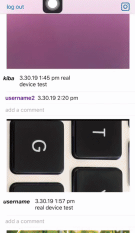
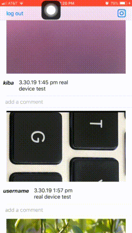

Parstagram - Part II

This is an Instagram clone with a custom Parse backend that allows a user to post photos, view a global photos feed, and add comments!

## User Stories
- [x] User stays logged in across restarts. 
- [x] User can log out.
- [x] User can view comments on a post. 
- [x] User can add a new comment.
- [x] User can cancel adding a photo.
- [x] User can hide keyboard when pressing return.
- [x] When writing a caption, the controller moves up and down with the keyboard.
- [x] User sees app icon in home screen and styled launch screen. 
- [x] User can sign up to create a new account. 
- [x] User can log in. 
- [x] User can take a photo, add a caption, and post it to the server.
- [x] User can view the last 20 posts.
- [x] User can pull to refresh.
- [x] User can see when post was created. Timeline is in sequential order.
- [ ] User can load past tweets infinitely.
- [ ] User can add a profile picture. 
- [ ] Profile pictures are shown for posts and comments.

## Video Walkthrough

Here's a walkthrough of implemented user stories:

